<center>
    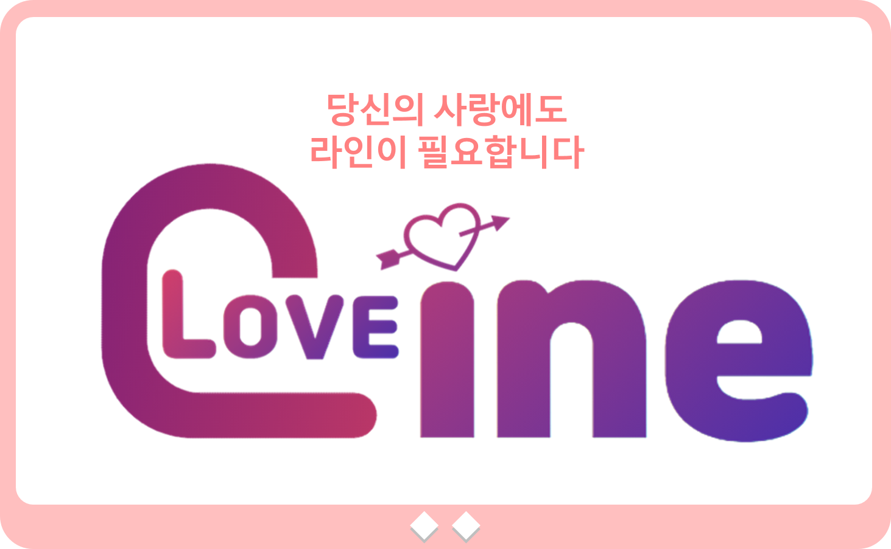
</center>


> LoveLine / 러브라인 (SSAFY 3rd 특화프로젝트)

### 🏠 [Github](https://github.com/jesuisjavert/loveline) :cinema:[Project 소개 UCC](https://www.youtube.com/watch?v=uVt-ZJOvBfE) :clapper:[Demo 시연영상](https://www.youtube.com/watch?v=BJctbq5bAhE) :microphone:[Presentation](https://drive.google.com/file/d/1vRn9mekf0BRuvwIz3FFD7gLnNMdkkyYM)

<br>

## :memo: Description 

```sh
하늘에 별도 따다주고 싶은 내 여자친구, 데이트 코스 짜느라 두통, 치통, 마음의 고통까지 겪고 계시나요?
더 이상 고민은 Stop! 당신의 사랑에도,'라인'이 필요합니다.
LoveLine은 빅데이터 분석 기반 데이트 코스 추천 웹 어플리케이션입니다.
```


## :pushpin: Project Goal

<center>
    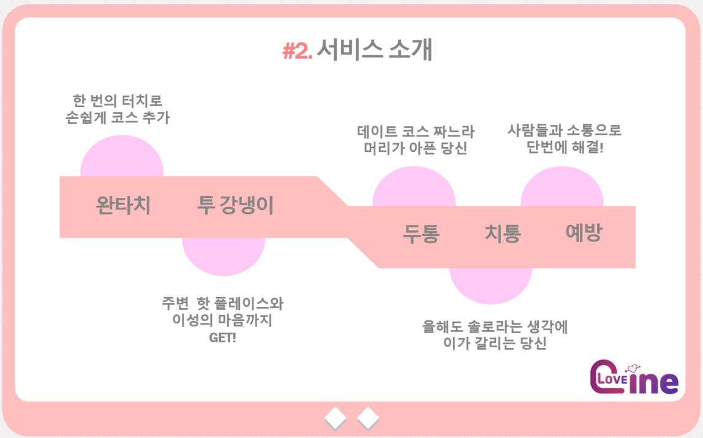<br>
</center>


##  ✨UCC

<center>
    
</center>

####                                                        												:cinema:[Project 소개 UCC](https://www.youtube.com/watch?v=uVt-ZJOvBfE)

## :mag: Overview

### 1. Intro Page (Scroll Event Interactive Design)

<center>
    
</center>
휠 이벤트에 따라, 한 페이지씩 내려가는 반응형 Intro 페이지 구성

<br>

### 2. Main Page (추천시스템 사용법 안내 및 지역별 특징 소개)

<center>
    <br>
</center>
hover 이벤트 발생 시 사이트 이용방법을 소개하는 컴포넌트 구성

<br>

### 3. 데이트 코스 추천 시연 (Dating Spot Recommendation)

<center>
    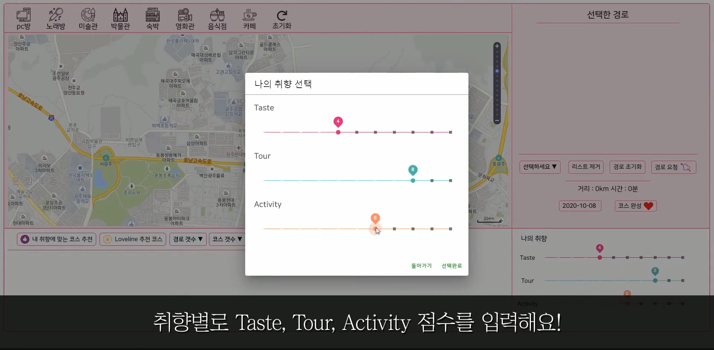<br>
    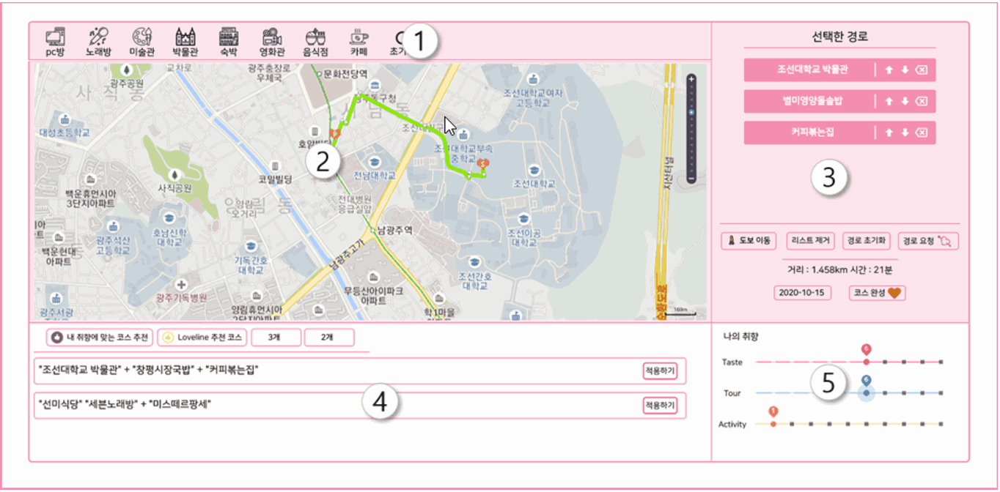<br>
</center>

자신의 취향 Parameter 값을 빅데이터로 분석하고, 추천 받은 데이트 명소들을 <br>
Tmap API 위에 뿌려서, 도보 or 차량에 따라 실시간 최적의 경로를 보여줌. <br><br>
자세한 시연은 Service Demo 시연 영상을 참조해주세요

#### :clapper:[Demo 시연영상](https://www.youtube.com/watch?v=BJctbq5bAhE)

  <br>

### 4. 데이트 코스 리뷰 기능 (Course Review CRUD)

<center>
    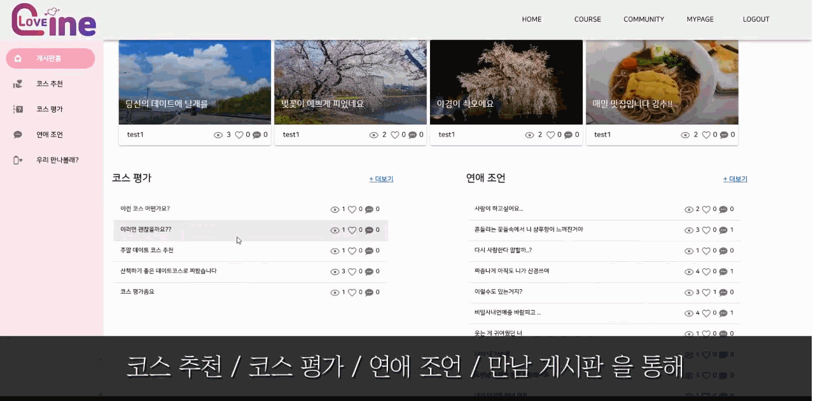
</center>
커뮤니티 게시판 및 리뷰 CRUD 기능

<br>

### 5. 만남 게시판 (Hang-out)

<center>
    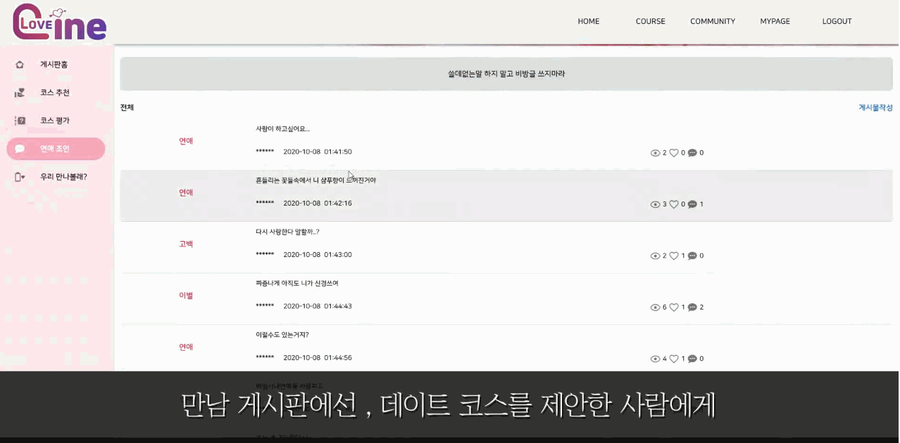
</center>
만남 게시판 (다중 이미지 업로드 기능)

<br>

### 6. My Page (Dating Spot Review Write & Schedule Managament)

<center>
    
</center>
My Page를 통해 회원별 데이트 코스 관리

<br>

## :wrench: Tech Stack

### Tech Stack

<center>
    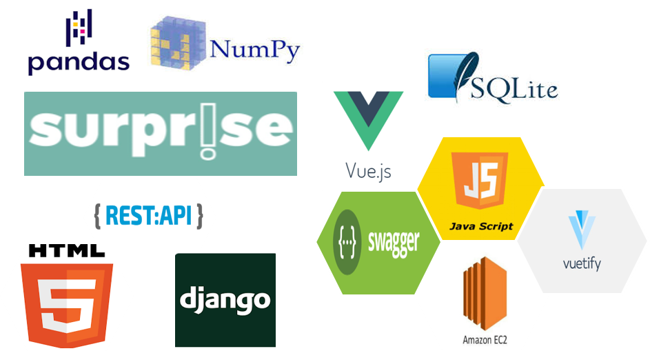
</center>


## :runner: 개발 과정

<center>
    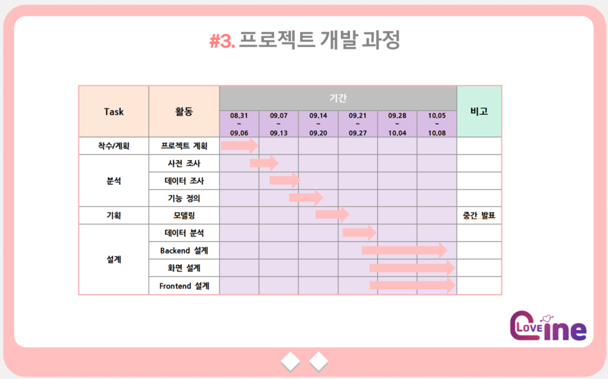
</center>


## :page_with_curl: REST API 기능 목록

<center>
    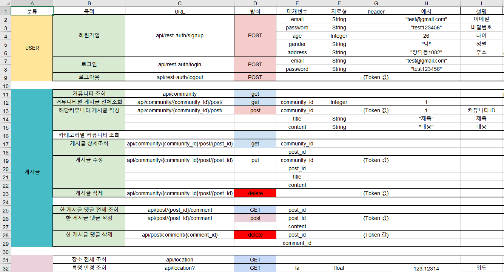
    더 자세한 REST_API 내용은 doc폴더의 심화_REST_API.xlsx 파일을 참조
</center>

<br>

## :pencil2: ERD

<center>
    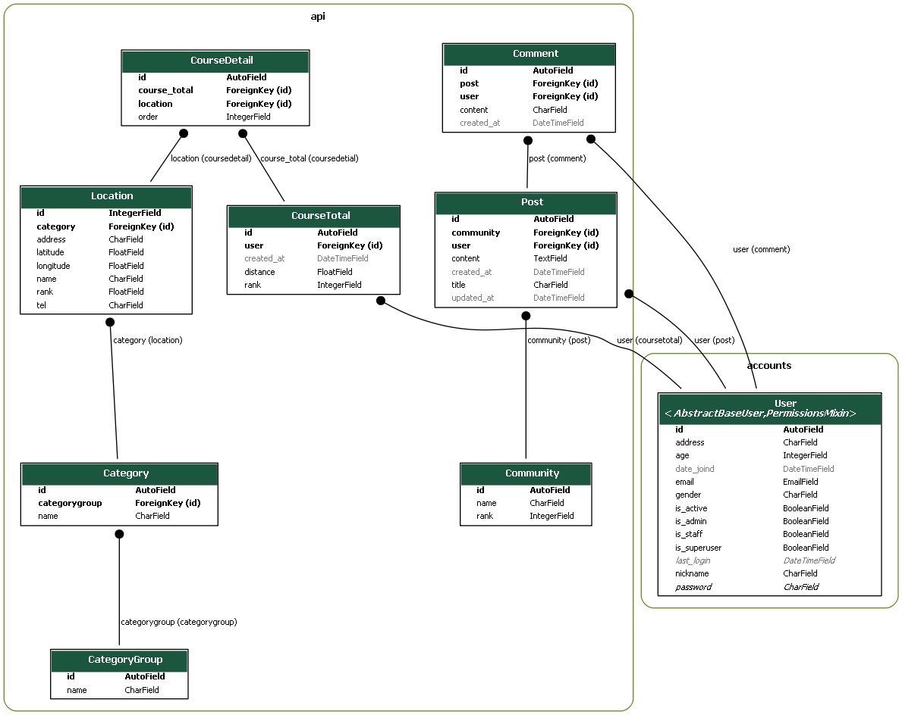
</center>
<br>

## :trophy: Awards

- SSAFY 특화 프로젝트 우수팀 UCC 우수상 선정 및 부상 30만원 수상

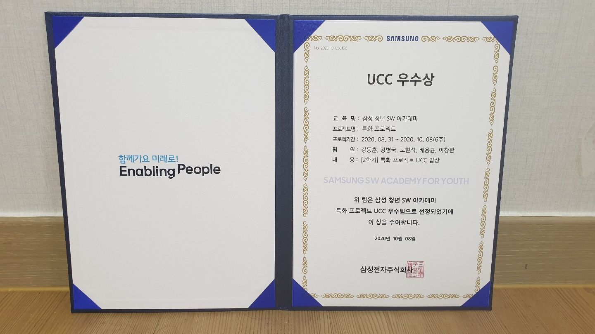


## 🤼‍♂️Author

Team Leader : 🦁 **Roh Hyunsuk**

Backend : 🐶 **Lee Changwan**

Backend: 🐺 **Bae Yongkyun**

Frontend : 🐯**Kang Donghoon**

Frontend : 🐱 **Kang Byungkook**


## 📝 License

Copyright © 2020 LoveLine 
